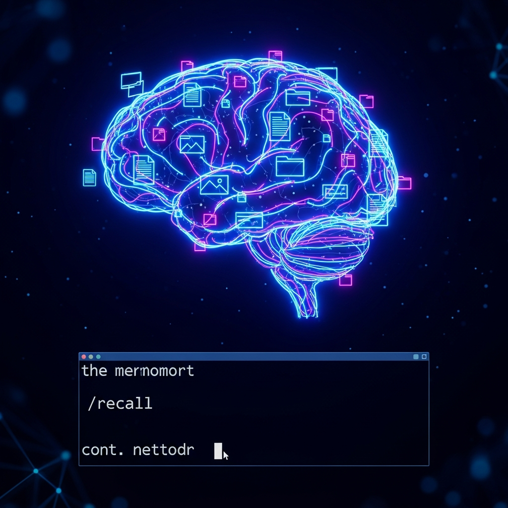

# /recall — Persistent Context for Claude Code



Never lose context after `/clear` again. `/recall` accumulates conversation context as you work and lets you bring it back with one command.

## What it does

```
you: /clear
you: /recall                          # last 10 context chunks, instant
you: /recall the docker dns thing     # semantic search, top 5 results
you: /recall --n 25                   # more chunks
you: /recall --deep auth refactor     # force Claude re-ranking for precision
you: /recall --stats                  # how much is stored
```

**Capture** happens silently via async hooks on every Write, Edit, Bash, and Agent tool call. Session summaries are captured at stop. Compaction summaries are captured at compact. You never have to do anything — context accumulates automatically.

**Restore** happens on demand. Two modes:
- **LIFO** (no args) — last N chunks, sub-100ms, most recent first
- **Semantic** (with query) — Model2Vec vector search + optional Claude re-ranking, 1-3s

## Architecture

```
~/.claude/context-store/
  {project-slug}/
    chunks/          # Markdown files with YAML frontmatter (human-readable)
    index.db         # SQLite: FTS5 full-text + Model2Vec embedding BLOBs
    config.json      # Retention policy, chunk limit, tool filters
  models/            # Model2Vec cache (~30MB)

~/.claude/hooks/context-capture.py    # Async hook (PostToolUse, Stop, PostCompact)
~/.claude/skills/recall/SKILL.md      # /recall skill definition
```

**Storage is markdown-first.** Every chunk is a readable `.md` file with YAML frontmatter. SQLite is an index, not the source of truth. You can browse, edit, or delete chunks by hand.

**Retrieval is hybrid.** LIFO is a timestamp sort on SQLite. Semantic search uses [Model2Vec](https://github.com/MinishLab/model2vec) (potion-retrieval-32M) — 30MB, numpy-only, no PyTorch, no GPU, sub-millisecond embedding. FTS5 provides keyword fallback if the model isn't available.

**Coexists with MEMORY.md.** This handles raw conversation context (ephemeral, granular). MEMORY.md handles curated facts (persistent, high-level). Different purpose, different lifecycle, no overlap.

## Install

```bash
# 1. Install the Python dependency
pip install model2vec

# 2. Copy files into place
cp -r context_store/ ~/.claude/context-store/context_store/
cp context-capture.py ~/.claude/hooks/
cp SKILL.md ~/.claude/skills/recall/SKILL.md

# 3. Register hooks in ~/.claude/settings.json
# Add to PostToolUse (matcher: Write|Edit|Bash|Agent):
{
  "matcher": "Write|Edit|Bash|Agent",
  "hooks": [{
    "type": "command",
    "command": "PYTHONPATH=~/.claude/context-store python3 ~/.claude/hooks/context-capture.py",
    "async": true
  }]
}

# Add the same command to Stop and PostCompact arrays (async: true)
```

Or use the install script:

```bash
./install.sh
```

## Config

`~/.claude/context-store/{project}/config.json`:

```json
{
  "chunk_limit": 5000,
  "retention_days": 30,
  "fast_restore_count": 10,
  "tool_type_filter": ["Write", "Edit", "Bash", "Agent"],
  "model_name": "minishlab/potion-retrieval-32M"
}
```

## How chunks look

```markdown
---
id: chunk-1775287054-053689
timestamp: 1775287054.053689
session_id: abc-123
project_slug: my-project
chunk_type: file_change
summary: Edited docker-compose.yml to add network_mode host
tags: [docker, networking]
tool_name: Edit
file_path: /home/user/docker-compose.yml
---

Changed:
  - network_mode: bridge
  + network_mode: host
```

## Dependencies

- **Python 3.10+**
- **model2vec** (numpy-only, ~30MB model) — degrades to FTS5 keyword search if missing
- **sqlite3** with FTS5 — included in Python stdlib

No PyTorch. No GPU. No external services. No MCP server.

## License

MIT
